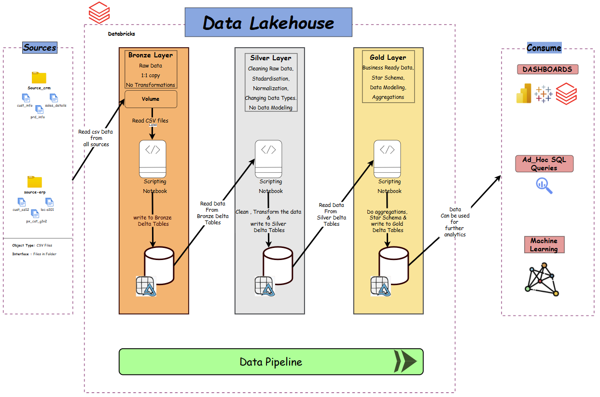

# databricks_lakehouse_pyspark_DE_project

In this project, I built a **complete Data Lakehouse** from scratch using **Databricks, PySpark** and the **Medallion Architectur**e.

I started with raw data and incrementally transformed it into clean, reliable and business-ready datasets across the **Bronze, Silver and Gold** layers using **PySpark DataFrame APIs** and **Delta Lake**.

I designed the end-to-end Lakehouse architecture, improved data quality through validations and transformations, modeled data for analytics use cases and automated the entire workflow using **Databricks pipelines and scheduled jobs**.

By the end, I delivered a **production-style Lakehouse solution** that is scalable, reliable and ready for downstream analytics and reporting.

## Data Architecture

